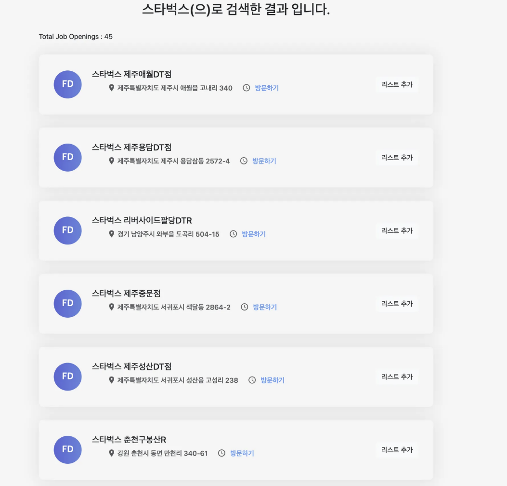
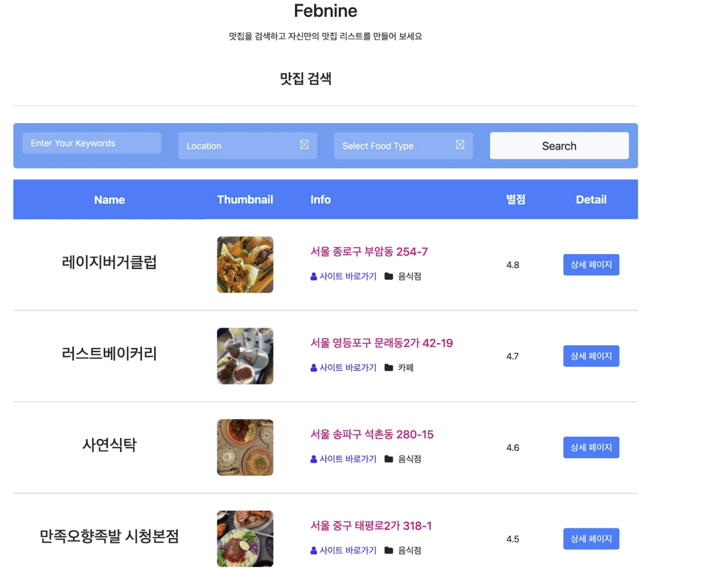

# 🍽️ FebNine

**FebNine**은 음식점을 검색하고 등록할 수 있는 웹 서비스입니다.  
카카오 Local API를 활용해 음식점 정보를 조회하고, 사용자 사진 및 메모 기능을 제공합니다.

## 📌 주요 기능

- 음식점 검색 (카카오 Local API 연동)
- 음식점 등록 및 사진 업로드
- 관리자 페이지에서 음식점 정보 관리 (수정/삭제)

## 🛠️ 기술 스택

- **Backend**: Node.js, Nest.js
- **Database**: MySQL
- **Frontend**: HTML, CSS, JavaScript
- **DevOps**: Docker, GitHub Actions (CI/CD), AWS

## 실행 방법

### 사전 조건
+ Node.js 16.X
+ yarn 1.22.17
+ .env.development or .env.test or .env.production
------------
### 레포지토리 클론
```bash
   git clone https://github.com/Rabongg/FebNine.git
   cd FebNine
```

### 의존성 설치
```bash
  yarn
```

### development 모드로 실행
```bash
  yarn start:dev
```

- swagger document
[swagger 문서](http://localhost:3000/api)

### production 모드

- docker-compose 수정 해주기
- /etc/nginx/default.conf 파일 생성해주기

### docker로 실행
- docker-compose 이용
```bash
  docker-compose up -d
```

- Dockerfile 변경했을 시
```bash
  docker-compose up -d --build
```

## CI/CD 구성

이 프로젝트는 GitHub Actions와 AWS를 활용해 CI/CD 파이프라인을 구성하였습니다.

- **CI (Continuous Integration)**  
  - `main` 브랜치에 push 발생 시, 자동으로 Docker 이미지를 빌드
  - Amazon ECR에 이미지 푸시

- **CD (Continuous Deployment)**  
  - ECR 이미지 푸시가 완료되면, AWS Systems Manager (SSM)을 사용해 EC2 인스턴스에서 배포 스크립트(`start.sh`) 실행
    -> start.sh의 경우 서버에 미리 존재해야함
  - EC2 인스턴스에서 최신 이미지를 pull하고, `docker-compose`를 통해 서비스 재배포

- **활용 기술 및 서비스**
  - GitHub Actions
  - Amazon ECR (Elastic Container Registry)
  - AWS SSM (Systems Manager)
  - Docker, docker-compose


## 화면 스크린 샷

| 음식점 검색 화면 | 음식점 검색 결과 화면 | 음식점 목록 화면                                            |
|-----------|------------|------------------------------------------------------|
|  |  |  |


